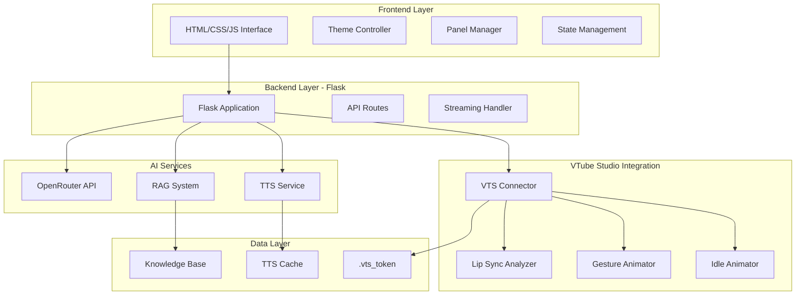
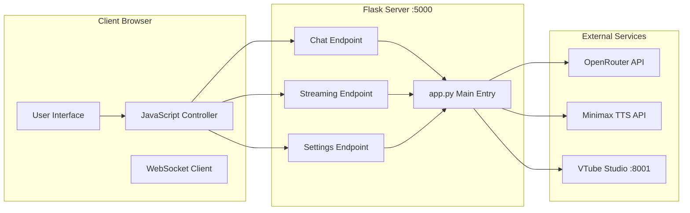
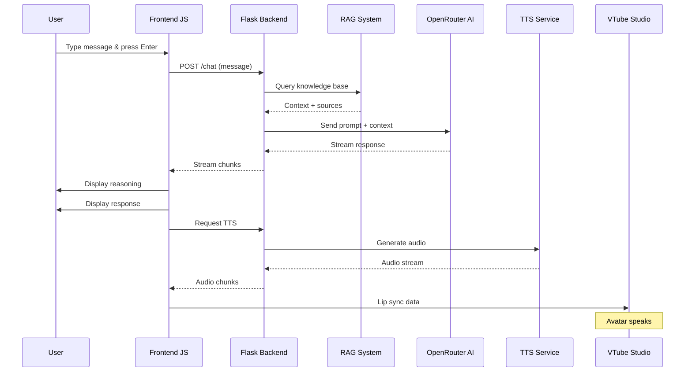
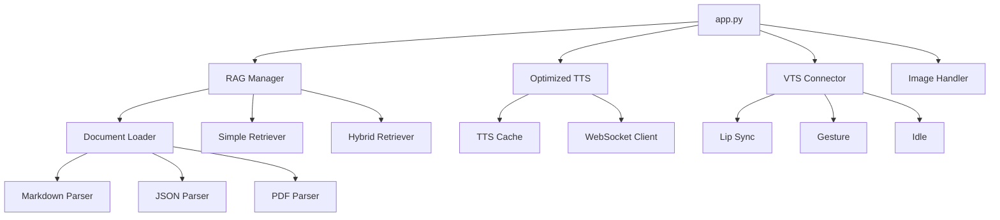

# System Architecture Overview

## High-Level Architecture



## Component Architecture



## Directory Structure

```
uitm-chatbot/
│
├── app.py                      # Main Flask application
├── minimax_tts.py              # Legacy TTS module
├── tts_optimized.py            # Optimized streaming TTS
├── requirements.txt            # Python dependencies
├── .env                        # Environment configuration
│
├── static/
│   ├── css/
│   │   └── styles.css          # Swedish geometry design
│   ├── js/
│   │   └── app.js              # Frontend logic
│   └── assets/
│       └── logo_uitm.png       # UiTM logo
│
├── templates/
│   └── index.html              # Main UI template
│
├── rag/                        # RAG System
│   ├── __init__.py
│   ├── rag_manager.py          # Main RAG orchestrator
│   ├── document_loader.py      # Document parsing
│   ├── chunker.py              # Text chunking
│   ├── embeddings.py           # Embedding generation
│   ├── vector_store.py         # Vector database
│   ├── retriever.py            # Hybrid retriever
│   ├── simple_retriever.py     # Keyword retriever
│   └── image_handler.py        # Image retrieval
│
├── vts/                        # VTube Studio Integration
│   ├── __init__.py
│   ├── connector.py            # WebSocket connector
│   ├── lip_sync.py             # Audio analysis
│   ├── gesture_animator.py     # Gesture system
│   ├── gesture_controller.py   # Body movement
│   ├── idle_animator.py        # Idle animations
│   ├── audio_converter.py      # MP3 to WAV
│   └── expressions.py          # Emotion mapping
│
├── knowledge_base/
│   ├── 02-admissions/          # Admission info
│   ├── 03-campus/              # Campus facilities
│   ├── 04-administrative/      # Admin info
│   └── assets/                 # KB images
│
├── tts_cache/                  # TTS audio cache
├── rag_cache/                  # RAG embeddings cache
└── vts_parameter_info/         # VTS parameter docs
```

## Data Flow Overview



## Module Dependencies



---

*Generated for UiTM AI Receptionist - System Documentation*
