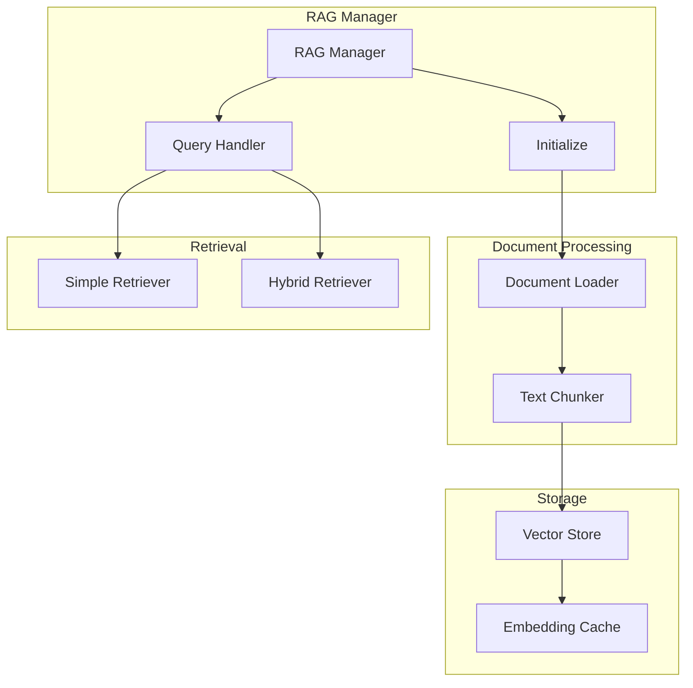
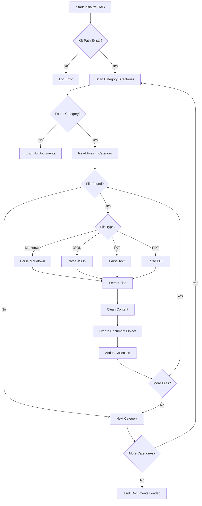
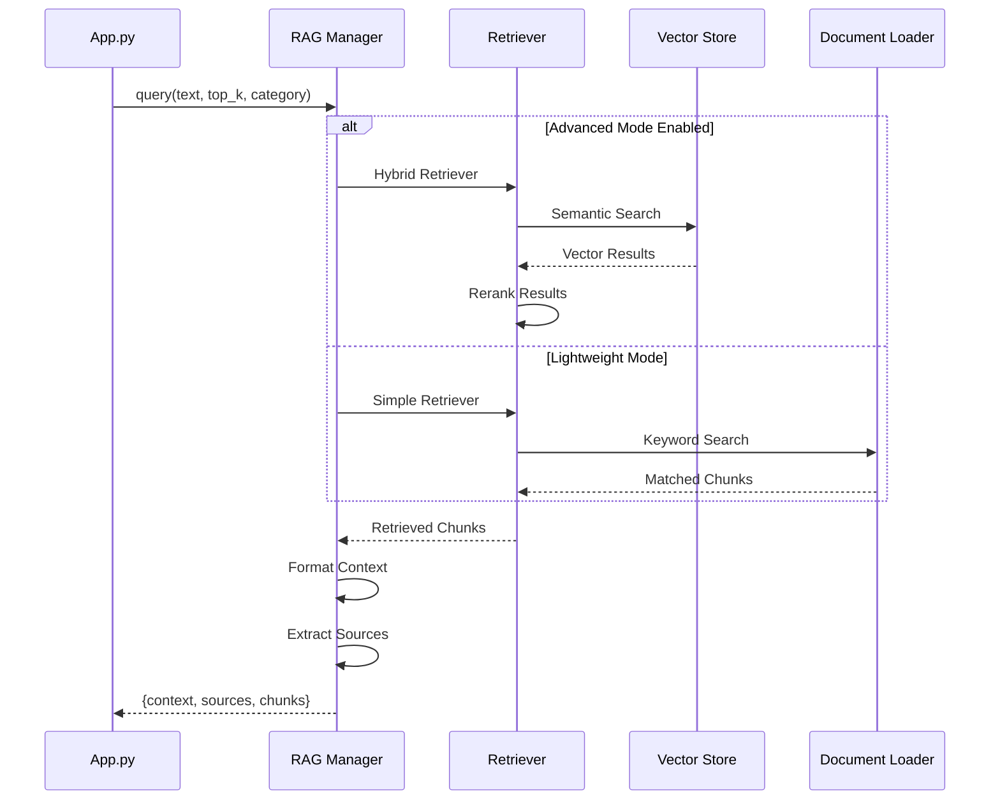
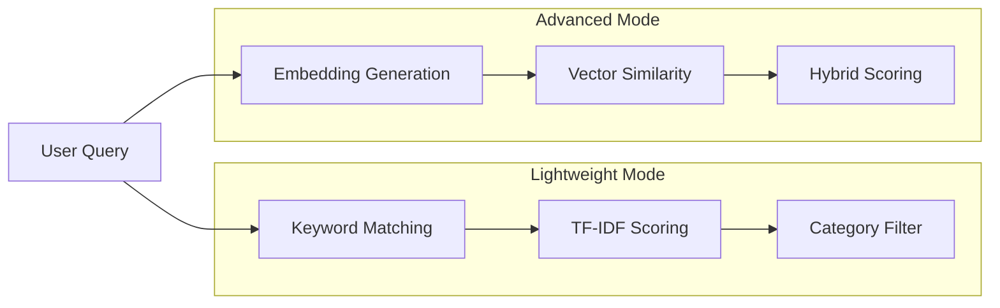
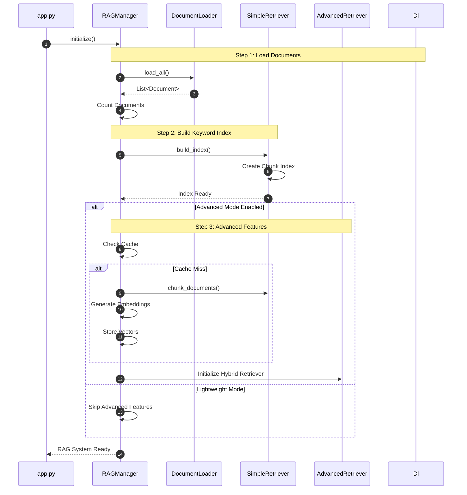
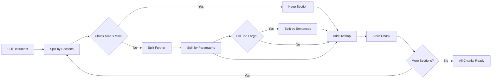

# RAG System Architecture

## Overview

The Retrieval-Augmented Generation (RAG) system enhances AI responses by retrieving relevant information from the UiTM knowledge base before generating answers.

## RAG Component Architecture



## Document Loading Process



## Query Processing Flow



## Two-Mode Retrieval System



## RAG Initialization Sequence



## Document Chunking (Advanced Mode)



## Source: `rag/rag_manager.py`

```python
class RAGManager:
    """
    Main manager for the RAG system
    Coordinates document loading, chunking, and retrieval
    """

    def initialize(self, force_reindex: bool = False):
        # Step 1: Load documents
        documents = self.document_loader.load_all()

        # Step 2: Build simple retriever (lightweight)
        self.simple_retriever = SimpleRetriever(self.document_loader)
        self.simple_retriever.build_index()

        # Step 3: Advanced features (optional)
        if self.use_advanced:
            self._init_advanced_features(force_reindex)

    def query(self, query_text: str, top_k: int = 5, category_filter: Optional[str] = None):
        if self.use_advanced and self.hybrid_retriever:
            return self._query_advanced(...)
        else:
            return self._query_simple(...)
```

## Source: `rag/simple_retriever.py`

```python
class SimpleRetriever:
    """Keyword-based retrieval without embeddings"""

    def build_index(self):
        """Build inverted index for keyword search"""
        for doc in self.document_loader.documents:
            chunks = self._chunk_document(doc.content)
            for chunk in chunks:
                self.chunk_index.append({
                    'content': chunk,
                    'doc_id': doc.id,
                    'category': doc.category
                })

    def retrieve(self, query: str, top_k: int, category_filter: str = None):
        """Retrieve chunks by keyword matching"""
        scores = []
        for chunk in self.chunk_index:
            score = self._keyword_score(query, chunk['content'])
            if category_filter:
                if chunk['category'] == category_filter:
                    scores.append((score, chunk))
            else:
                scores.append((score, chunk))

        scores.sort(reverse=True)
        return [chunk for score, chunk in scores[:top_k]]
```

---

*Generated for UiTM AI Receptionist - RAG System Documentation*
