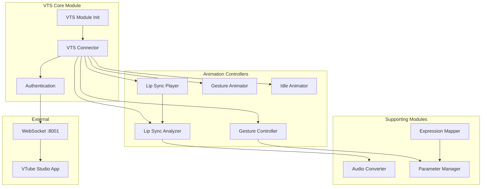
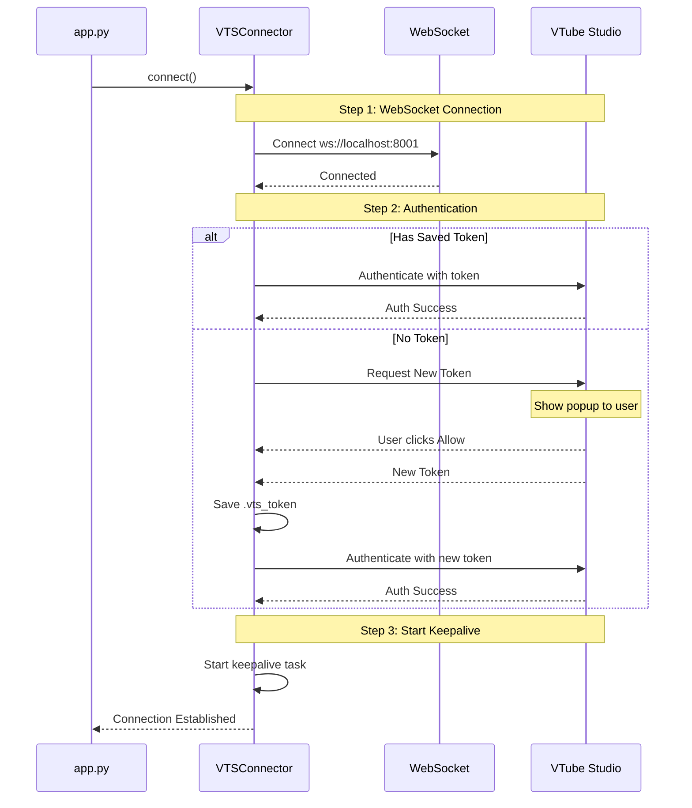
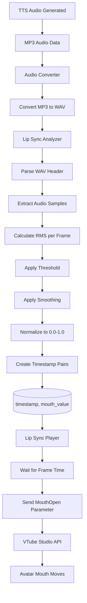
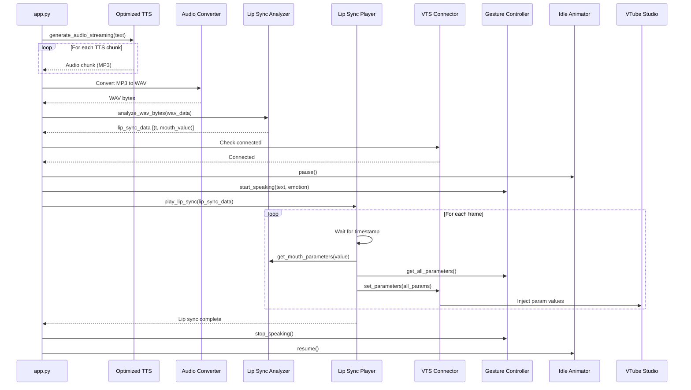
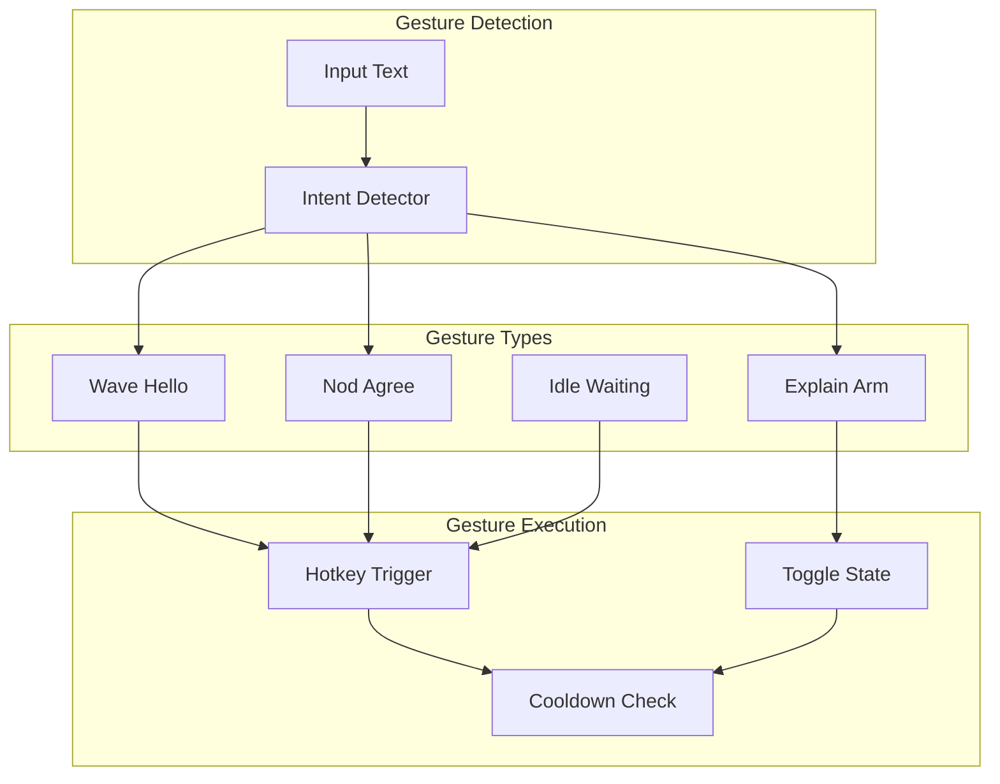
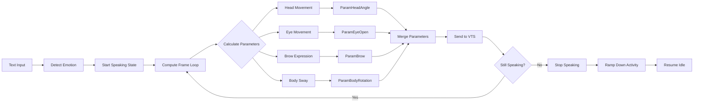
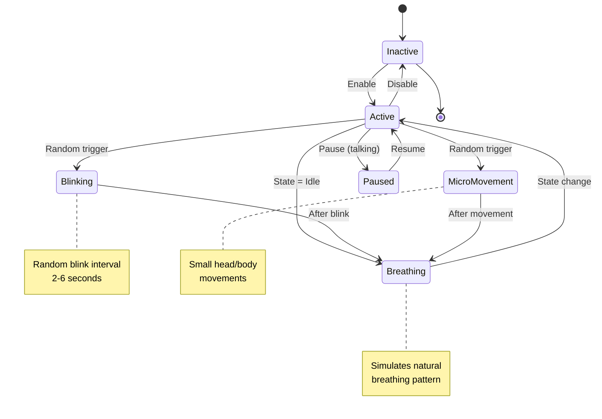
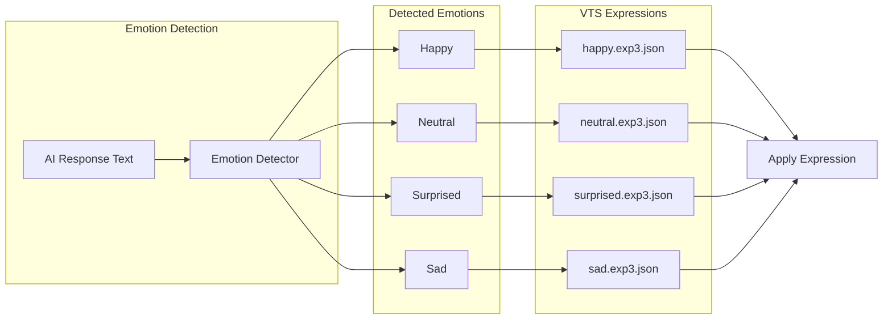

# VTube Studio Integration Architecture

## Overview

The VTube Studio integration provides real-time avatar animation synchronized with TTS audio, including lip sync, gestures, and idle animations.

## VTS Component Architecture



## Connection & Authentication Flow



## Lip Sync Pipeline



## Complete Animation Flow with TTS



## Gesture System Architecture



## Gesture Controller - Body Movement



## Idle Animation System



## Expression Mapping



## VTS Parameter Architecture

```mermaid
graph TB
    subgraph "Input Parameters (Tracking)"
        MOUTH_IN[MouthOpen]
        BROW_IN[BrowLeftY]
        EYE_IN[EyeOpenLeft]
    end

    subgraph "Output Parameters (Live2D)"
        MOUTH_OUT[ParamMouthOpenY]
        BROW_OUT[ParamBrowLY]
        EYE_OUT[ParamEyeOpenLeft]
    end

    subgraph "Binding Layer"
        BIND1[Mouth Binding]
        BIND2[Brow Binding]
        BIND3[Eye Binding]
    end

    MOUTH_IN --> BIND1 --> MOUTH_OUT
    BROW_IN --> BIND2 --> BROW_OUT
    EYE_IN --> BIND3 --> EYE_OUT

    Note over MOUTH_IN: API injection point
    Note over MOUTH_OUT: Model control point
```

## Source: `vts/connector.py`

```python
class VTSConnector:
    """WebSocket connector for VTube Studio Plugin API."""

    async def connect(self) -> bool:
        # Connect to WebSocket
        self.websocket = await websockets.connect(uri)

        # Authenticate
        success = await self._authenticate()

        # Ensure mouth parameter exists
        await self._ensure_mouth_parameter()

        # Start keepalive
        self._start_keepalive()

    async def set_parameters(self, parameters: List[Dict]) -> bool:
        """Set multiple parameter values at once."""
        response = await self._send_request(
            "InjectParameterDataRequest",
            {
                "faceFound": True,
                "mode": "set",
                "parameterValues": parameters
            }
        )
        return "errorID" not in response.get("data", {})
```

## Source: `vts/lip_sync.py`

```python
class LipSyncAnalyzer:
    """Analyzes audio waveforms to generate lip sync data."""

    def analyze_wav_bytes(self, wav_data: bytes) -> List[Tuple[float, float]]:
        # Parse WAV header
        sample_rate, audio_samples = self._parse_wav(wav_data)

        # Calculate samples per frame
        samples_per_frame = int(sample_rate / self.target_fps)

        # Generate (timestamp, mouth_value) pairs
        for each frame:
            rms = sqrt(sum(samples^2) / count)  # RMS amplitude
            value = min(1.0, rms * sensitivity)
            value = prev * smoothing + value * (1 - smoothing)
            results.append((timestamp, value))
```

## Source: `vts/gesture_animator.py`

```python
class GestureAnimator:
    """Manages gesture animations via VTube Studio hotkeys."""

    async def trigger_gesture(self, gesture: GestureType, force: bool = False) -> bool:
        # Check cooldown
        if not force and time_since_last_gesture < cooldown:
            return False

        # Handle toggle gestures
        if gesture in toggle_gestures:
            return await self._handle_toggle_gesture(gesture)

        # Trigger hotkey
        return await self._trigger_hotkey(gesture)

    def detect_greeting(self, text: str) -> bool:
        return any(keyword in text for keyword in greeting_keywords)

    def detect_explanation_context(self, text: str) -> bool:
        return any(indicator in text for indicator in explanation_indicators)
```

---

*Generated for UiTM AI Receptionist - VTube Studio Integration Documentation*
