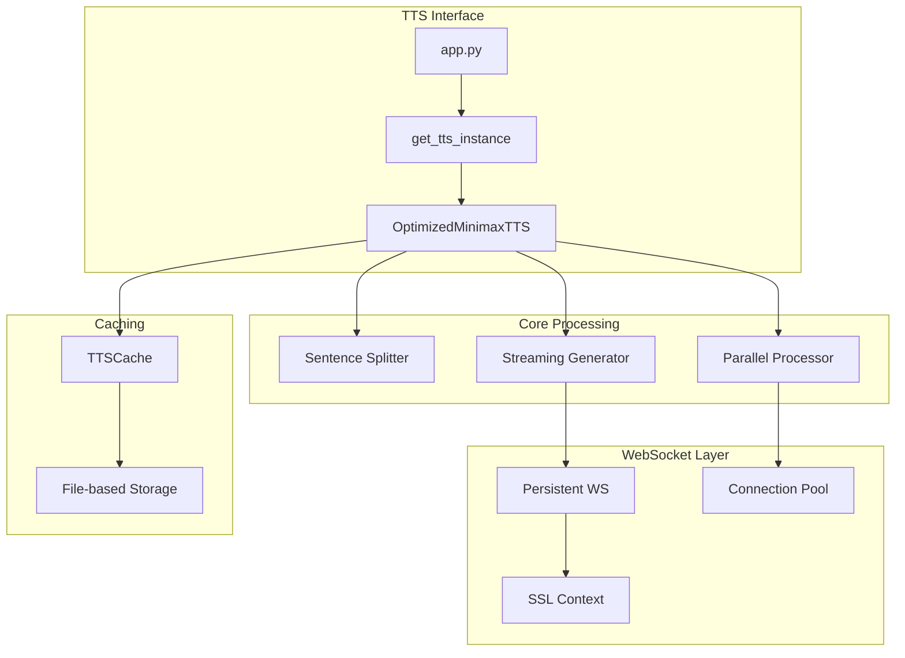
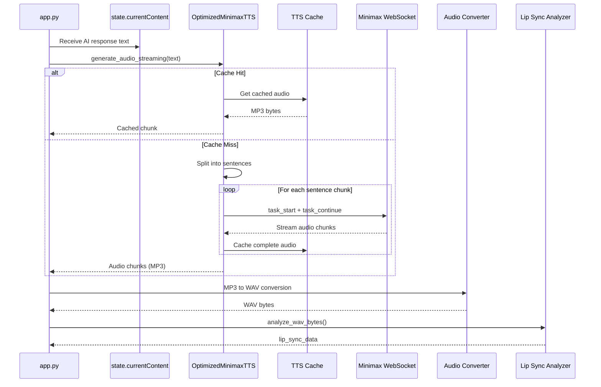
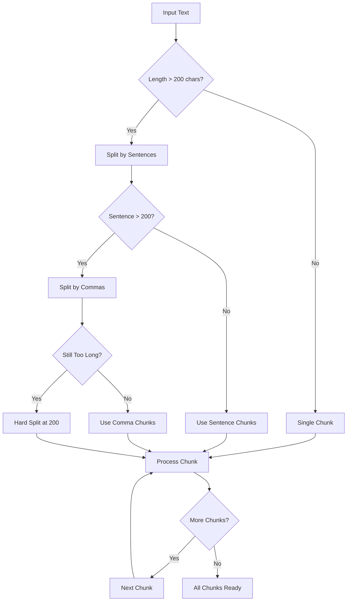
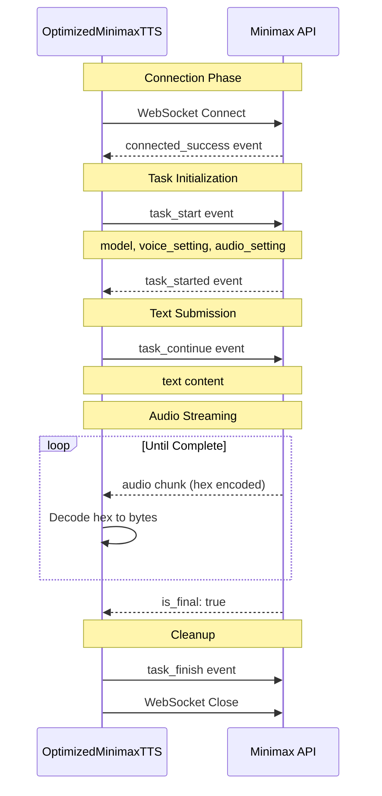
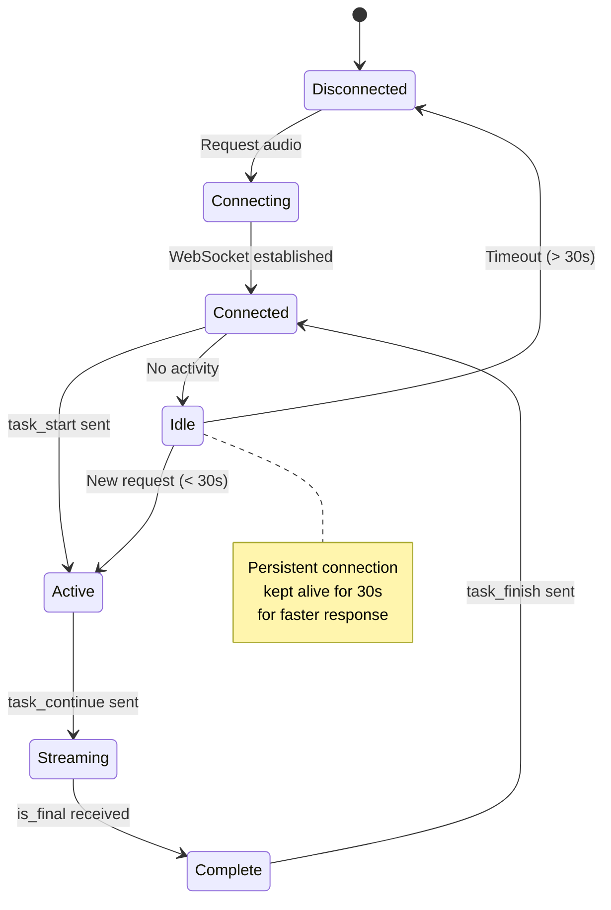
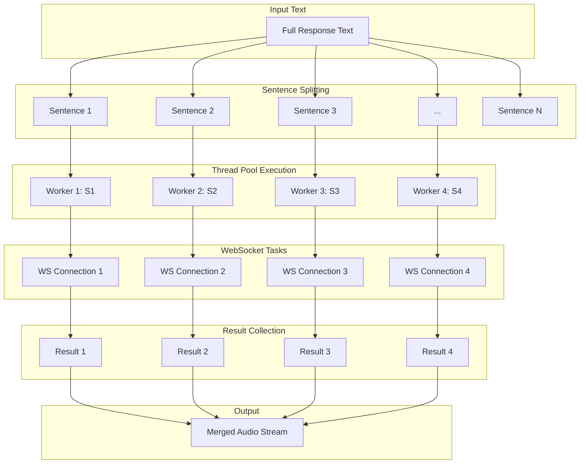
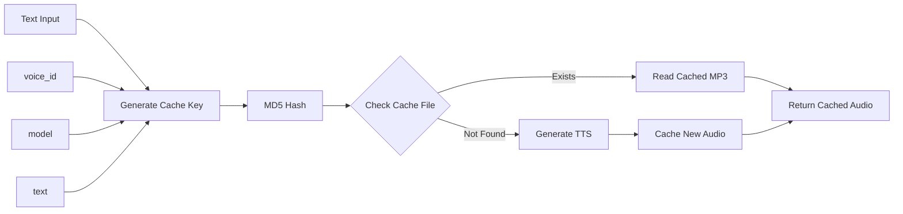

# TTS Pipeline Architecture

## Overview

The Text-to-Speech (TTS) system uses Minimax API with optimized streaming, persistent WebSocket connections, and parallel processing for low-latency audio generation.

## TTS Component Architecture



## TTS Request Flow



## Sentence Chunking Strategy



## WebSocket Communication Protocol



## Persistent WebSocket Optimization



## Parallel Processing Architecture



## Audio Caching System



## TTS Configuration Options

```mermaid
graph TB
    subgraph "Model Settings"
        MODEL[Model: speech-2.8-turbo]
        VOICE[Voice: Malay_male_1_v1]
        LANG[Language: Malay]
    end

    subgraph "Audio Settings"
        SAMPLE[Sample Rate: 32000 Hz]
        BITRATE[Bitrate: 128000 kbps]
        FORMAT[Format: MP3]
        CHANNEL[Channel: 1 (Mono)]
    end

    subgraph "Voice Settings"
        SPEED[Speed: 1.0]
        VOLUME[Volume: 1.0]
        PITCH[Pitch: 0]
    end

    subgraph "Pronunciation"
        TONE[Tone: uitm/UITM]
    end
```

## Source: `tts_optimized.py`

```python
class OptimizedMinimaxTTS:
    """Optimized Minimax TTS with persistent WebSocket and caching."""

    async def generate_audio_streaming(
        self,
        text: str,
        on_chunk: Optional[Callable[[TTSChunk], None]] = None
    ) -> AsyncGenerator[TTSChunk, None]:
        # Check cache first
        if self.cache:
            cached = self.cache.get(text, self.config["voice_id"], self.config["model"])
            if cached:
                yield TTSChunk(audio_bytes=cached, text=text, is_last=True)
                return

        # Split into sentences
        sentences = self.split_into_sentences(text)

        if len(sentences) == 1:
            # Single sentence - streaming
            async for chunk in self._generate_single_sentence_streaming(...):
                yield chunk
        else:
            # Multiple sentences - parallel processing
            async for chunk in self._generate_parallel_sentences(sentences, ...):
                yield chunk
```

## Source: Audio Converter (`vts/audio_converter.py`)

```python
class AudioConverter:
    """Converts MP3 audio to WAV format for lip sync analysis."""

    @staticmethod
    def mp3_to_wav(mp3_bytes: bytes) -> bytes:
        """
        Convert MP3 to WAV using ffmpeg.

        Args:
            mp3_bytes: MP3 audio data

        Returns:
            WAV audio data
        """
        # Create temp files
        mp3_path = f"temp_input_{timestamp}.mp3"
        wav_path = f"temp_output_{timestamp}.wav"

        # Write MP3
        with open(mp3_path, 'wb') as f:
            f.write(mp3_bytes)

        # Run ffmpeg conversion
        subprocess.run([
            'ffmpeg', '-i', mp3_path,
            '-ar', '32000',  # 32kHz sample rate
            '-ac', '1',     # Mono
            wav_path
        ])

        # Read WAV
        with open(wav_path, 'rb') as f:
            wav_bytes = f.read()

        # Cleanup temp files
        os.remove(mp3_path)
        os.remove(wav_path)

        return wav_bytes
```

## Performance Metrics

```
TTS Pipeline Timing (typical):
├── Cache lookup: <1ms
├── Sentence splitting: <5ms
├── WebSocket connection: 50-200ms (if not persistent)
├── First audio chunk: 200-500ms
├── Full audio generation: 1-3 seconds
├── MP3 to WAV conversion: 100-300ms
└── Lip sync analysis: 50-100ms

With persistent WebSocket:
- Connection overhead eliminated
- Response time improved by 50-200ms
```

---

*Generated for UiTM AI Receptionist - TTS Pipeline Documentation*
