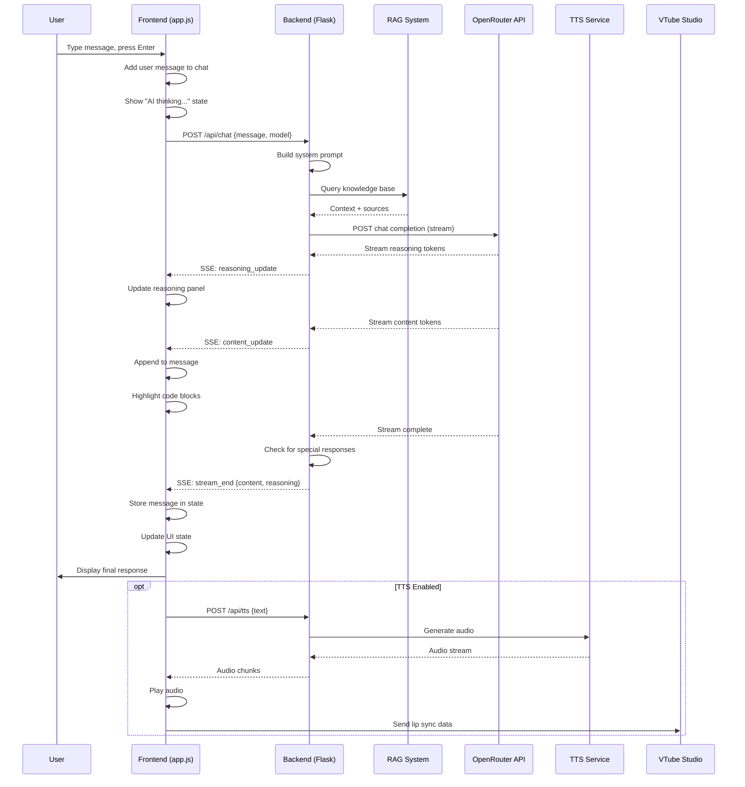
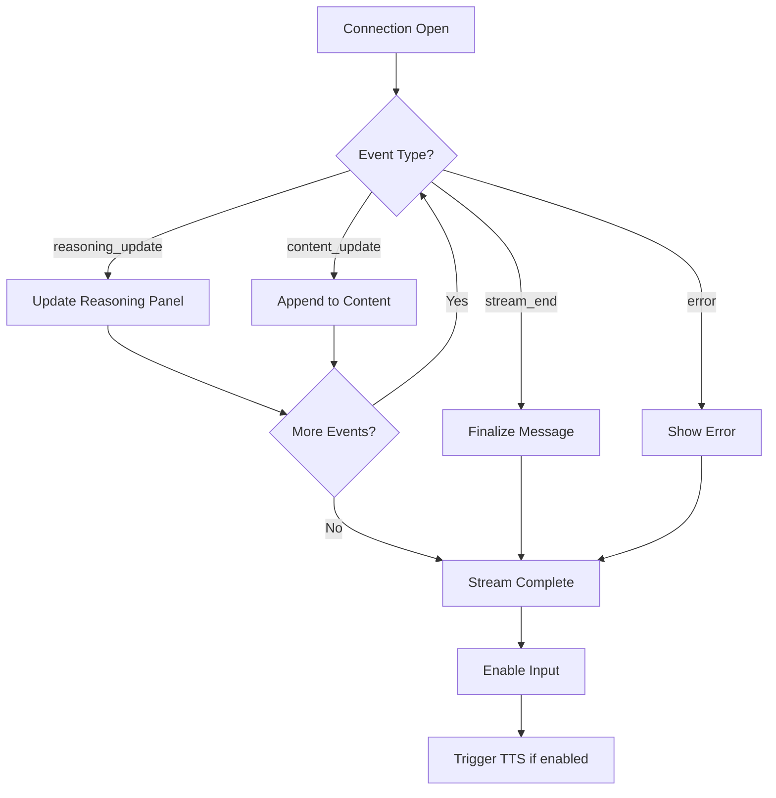
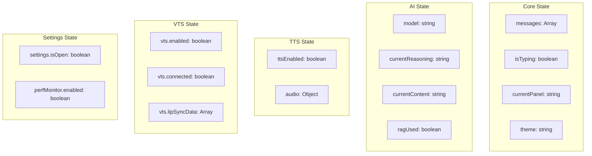
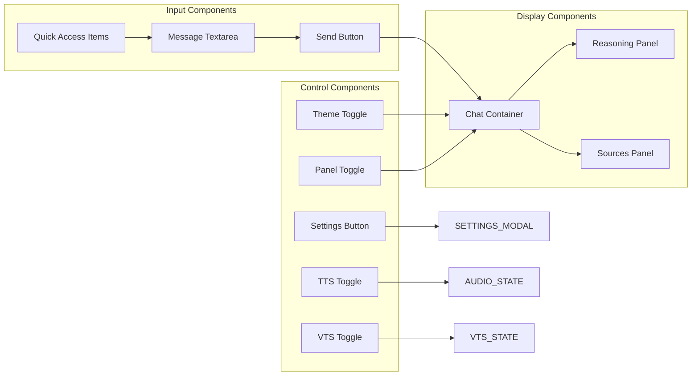
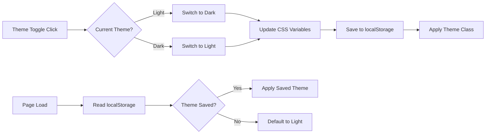
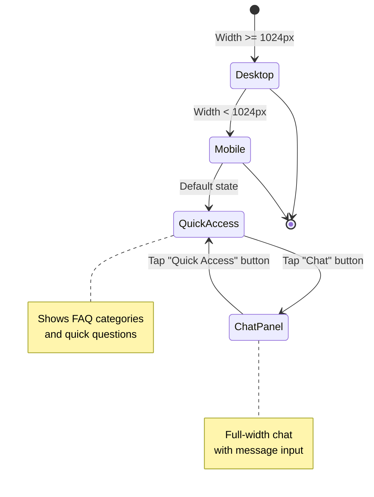
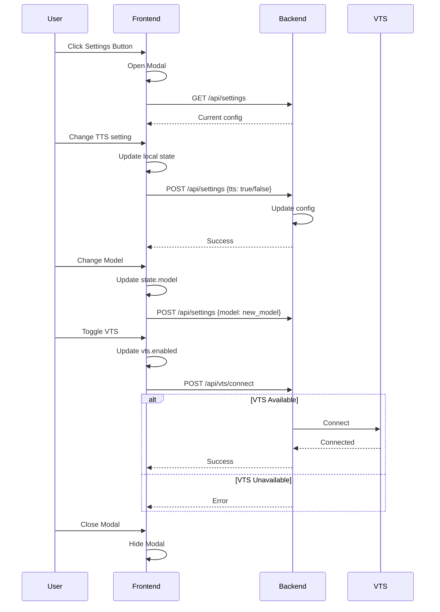

# Frontend-Backend Interaction

## Overview

This document describes the communication patterns between the frontend (browser) and backend (Flask) components of the UiTM AI Receptionist.

## API Endpoints

```mermaid
graph TB
    subgraph "Frontend Routes"
        HOME[/]
        CHAT[/api/chat]
        CHAT_STREAM[/api/chat/stream]
        SETTINGS[/api/settings]
        VTS_STATUS[/api/vts/status]
    end

    subgraph "Backend Handlers"
        INDEX[render_template]
        CHAT_HDL[chat_handler]
        STREAM_HDL[stream_handler]
        CONFIG[config_handler]
        STATUS[status_handler]
    end

    HOME --> INDEX
    CHAT --> CHAT_HDL
    CHAT_STREAM --> STREAM_HDL
    SETTINGS --> CONFIG
    VTS_STATUS --> STATUS
```

## Complete Chat Flow



## Message Streaming Protocol



## State Management Architecture



## UI Component Interactions



## Theme System



## Mobile Panel System



## Settings Modal Flow



## Event Source (SSE) Handling

```javascript
// Frontend SSE handler (simplified from app.js)

function startChatStream(message, model) {
    const eventSource = new EventSource(`/api/chat/stream?message=${encodeURIComponent(message)}&model=${model}`);

    eventSource.onmessage = (event) => {
        const data = JSON.parse(event.data);

        switch(data.type) {
            case 'reasoning_update':
                state.currentReasoning += data.content;
                updateReasoningDisplay();
                break;

            case 'content_update':
                state.currentContent += data.content;
                updateMessageDisplay();
                break;

            case 'stream_end':
                eventSource.close();
                finalizeMessage(data);
                if (state.ttsEnabled) {
                    triggerTTS(state.currentContent);
                }
                break;

            case 'error':
                eventSource.close();
                showError(data.message);
                break;
        }
    };
}
```

## Backend Route Handlers

```python
# Flask routes (simplified from app.py)

@app.route('/')
def index():
    return render_template('index.html')

@app.route('/api/chat', methods=['POST'])
def chat():
    data = request.json
    message = data.get('message')
    model = data.get('model', DEFAULT_MODEL)

    # Query RAG for context
    rag_result = rag_manager.query(message, top_k=5)

    # Build messages for AI
    messages = build_prompt(message, rag_result['context'])

    # Call OpenRouter API
    response = call_openrouter(messages, model)

    return jsonify({
        'response': response['content'],
        'reasoning': response['reasoning'],
        'sources': rag_result['sources']
    })

@app.route('/api/chat/stream', methods=['GET'])
def chat_stream():
    message = request.args.get('message')
    model = request.args.get('model', DEFAULT_MODEL)

    def generate():
        # Stream from OpenRouter
        for chunk in stream_openrouter(message, model):
            if chunk.type == 'reasoning':
                yield f"data: {json.dumps({'type': 'reasoning_update', 'content': chunk.content})}\n\n"
            elif chunk.type == 'content':
                yield f"data: {json.dumps({'type': 'content_update', 'content': chunk.content})}\n\n"

        yield f"data: {json.dumps({'type': 'stream_end'})}\n\n"

    return Response(generate(), mimetype='text/event-stream')
```

## Keyboard Shortcuts

```
┌─────────────────────────────────────────────────────┐
│ Keyboard Shortcuts                                  │
├─────────────────────────────────────────────────────┤
│ Enter           │ Send message                      │
│ Shift + Enter   │ New line in textarea              │
│ Escape          │ Close modal / Cancel              │
│ Ctrl + K        │ Focus search/quick access         │
│ Ctrl + T        │ Toggle theme                      │
│ Ctrl + ,        │ Open settings                     │
└─────────────────────────────────────────────────────┘
```

---

*Generated for UiTM AI Receptionist - Frontend-Backend Interaction Documentation*
