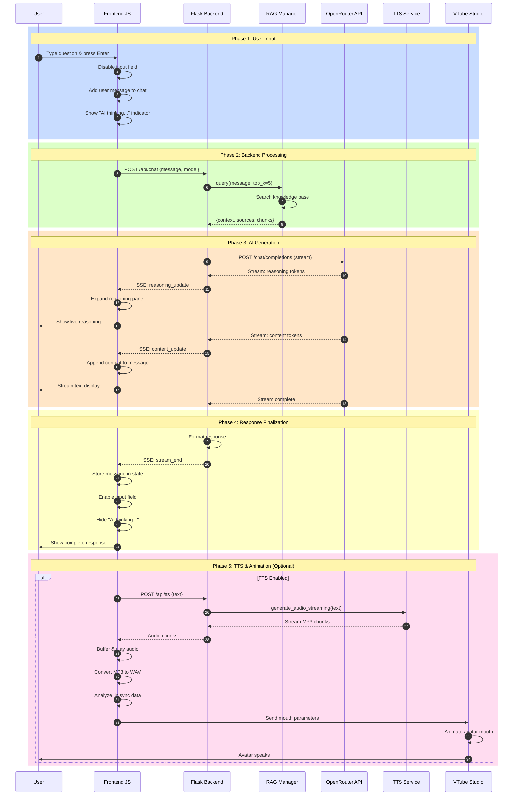
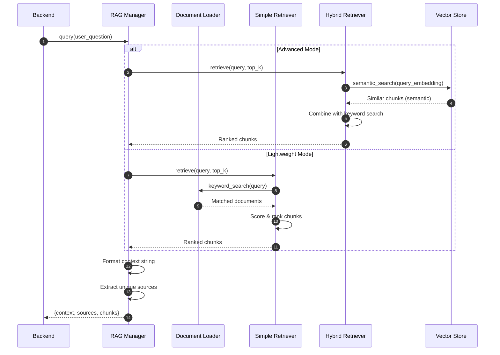
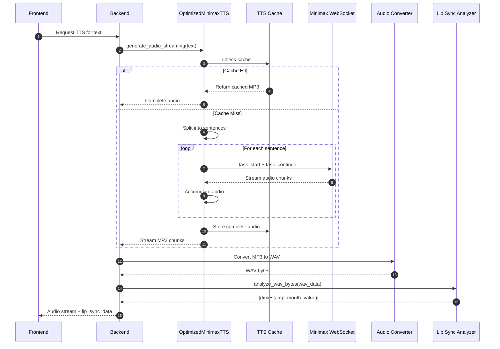
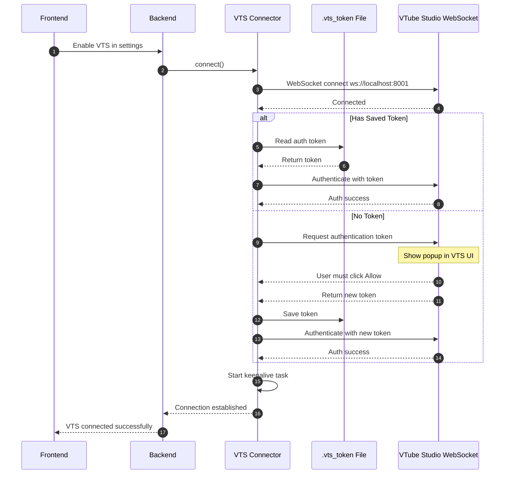
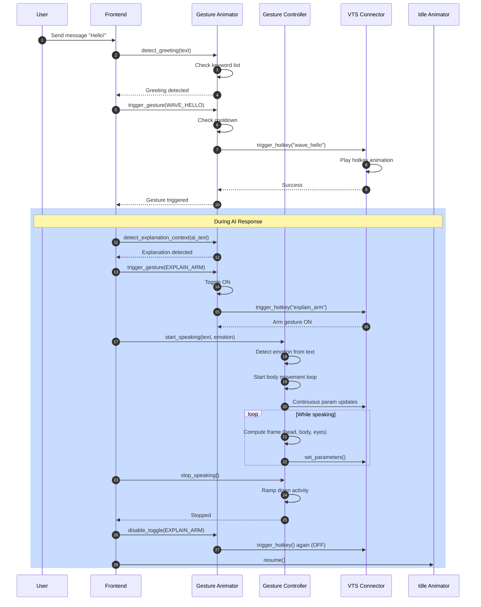
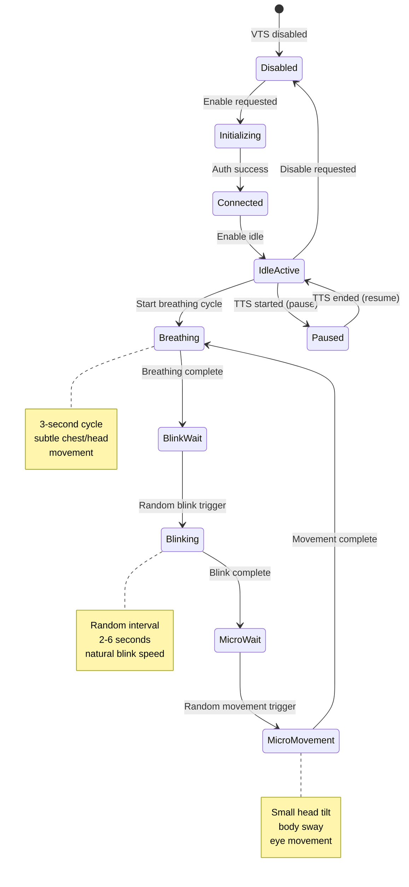
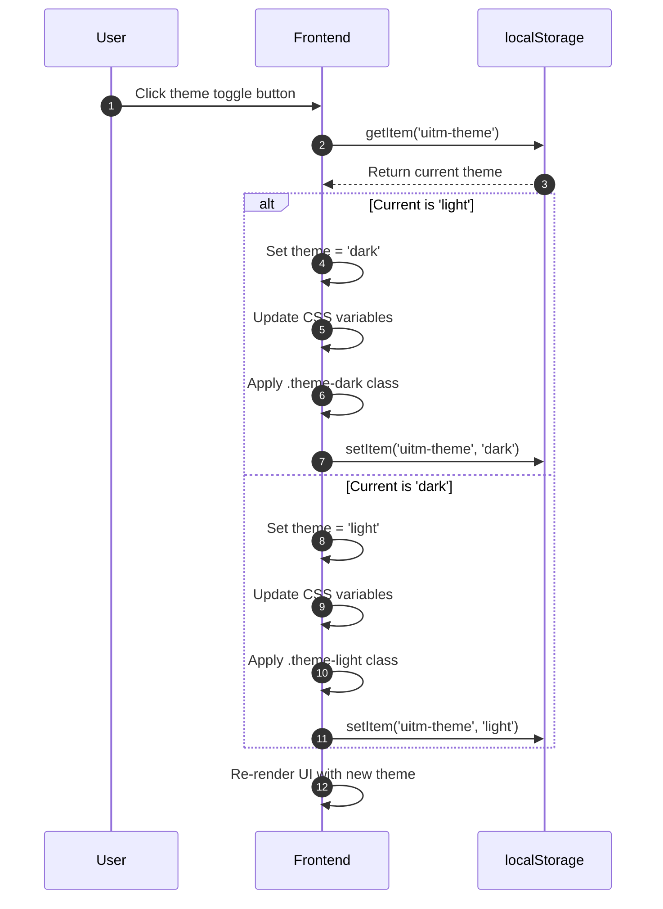
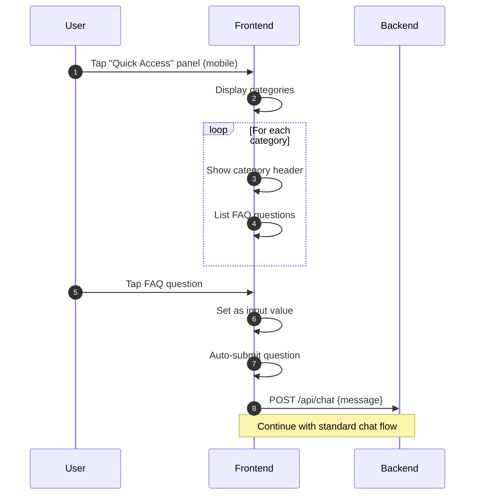
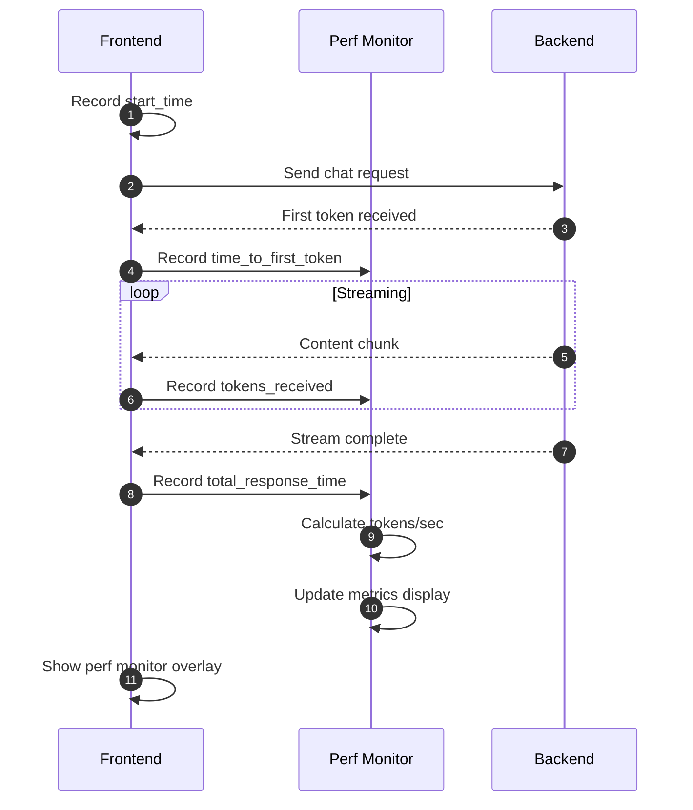

# Data Flow Sequence Diagrams

## Overview

This document provides detailed sequence diagrams for the main data flows in the UiTM AI Receptionist system.

---

## 1. Complete User Query Flow



---

## 2. RAG Query Flow



---

## 3. TTS Audio Generation Flow



---

## 4. VTube Studio Connection Flow



---

## 5. Gesture Animation Flow



---

## 6. Idle Animation System Flow



---

## 7. Theme Switching Flow



---

## 8. Quick Access Flow (Mobile)



---

## 9. Error Handling Flow

```mermaid
flowchart TD
    A[API Request] --> B{Request Success?}
    B -->|Yes| C[Process Response]
    B -->|No| D[Error Handler]

    D --> E{Error Type?}
    E -->|Network| F[Show "Connection Error"]
    E -->|API Key| G[Show "API Not Configured"]
    E -->|VTS| H[Show "VTS Unavailable"]
    E -->|TTS| I[Fallback: Text Only]

    F --> J[Log Error]
    G --> J
    H --> J
    I --> K[Disable TTS Flag]

    J --> L[Re-enable Input]
    K --> L
    C --> L
```

---

## 10. Performance Metrics Collection



---

*Generated for UiTM AI Receptionist - Data Flow Documentation*
